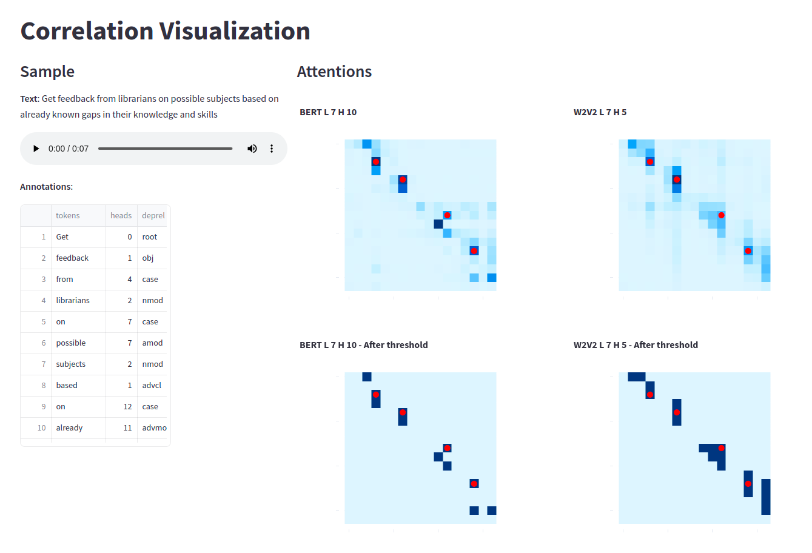

# SoundOfAttention

This paper explores the correlations between attention layers of Audio Speech Recognition (ASR) and Natural Language Processing (NLP) models, with the aim of improving ASR performance and gaining insights into the existence of hidden language models in ASR.
We build upon previous research on attention mechanisms and use BERT for NLP and Wav2vec2 for ASR.
We define a metric for correlation, compare attention layers, address alignment challenges, and investigate the relationship across the English language.
Our user-friendly interface visually presents aligned attention matrices, aiding in model analysis and investigating those correlations.
The paper concludes with potential linguistic and semantic realtions between those models, and with a method and metrics that can be applied for feature research.

### Interactive Interface for Correlation Investigation
